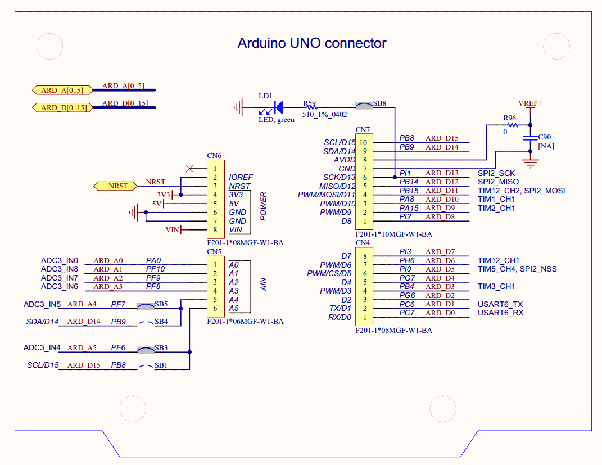

# BoatRobot

STM32F4 Discovery based Boat Controller

The project file can be opened in Visual Studio with VisualGDB.
It uses the HAL library and has a STMCube PinOut reference file.

The board features a touch screen and has an adruino shield connector.

A ESP8266 wifi module is used with JeeLabs esp-link firmware.
https://github.com/jeelabs/esp-link

Main components
- USB VCP-CDC (TODO)
- PMW control via Wifi (TODO)